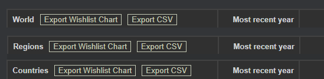
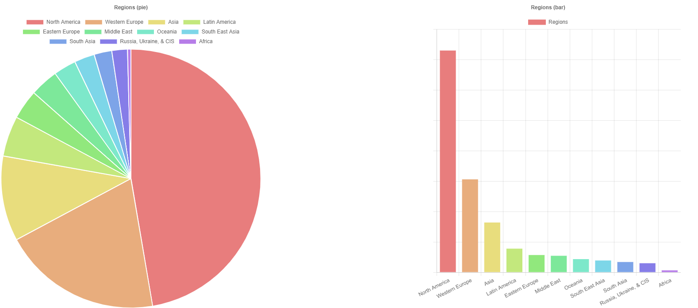
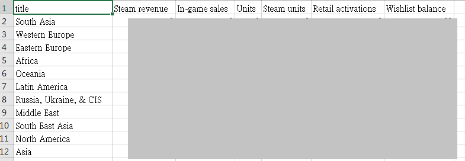
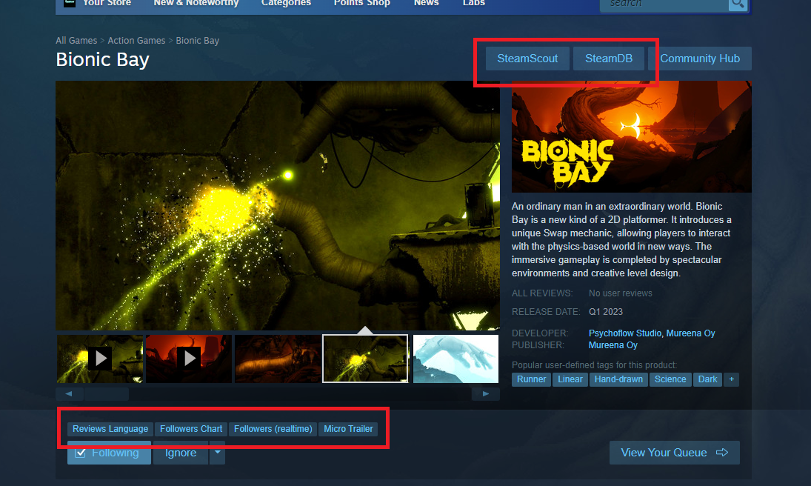

# Steam Marketing Tool
Steam Marketing Tool is an Chrome Extensions for analyzing marketing data on Steam and Steamworks.

- [Features](#features)
  - [Export Regional Wishlists on Steamworks](#export-regional-wishlists-on-steamworks)
    - [Export Wishlist Chart](#export-wishlist-chart)
    - [Export CSV](#export-csv)
  - [Add links on Steam store page](#add-links-on-steam-store-page)
- [Getting Started](#getting-started)
  - [Install Chrome Extension](#install-chrome-extension)
- [Chart Tool (for regional wishlists)](#chart-tool-for-regional-wishlists)
    - [GET Params](#get-params)

# Features
## Export Regional Wishlists on Steamworks
Matching URL: `*://partner.steampowered.com/region/*`

e.g. https://partner.steampowered.com/region/

### Export Wishlist Chart
Passing data to [Chart Tool](#chart-tool-for-regional-wishlists) to show the regional wishlist charts.

### Export CSV
Export and download a CSV file.

## Add links on Steam store page
Matching URL: `*://store.steampowered.com/app/*`

e.g. https://store.steampowered.com/app/1928690/Bionic_Bay/

* [SteamDB](https://steamdb.info/)
* [SteamScout](https://www.togeproductions.com/SteamScout/steamAPI.php) - Steam reviews language breakdown
* Realtime followers - https://steamcommunity.com/search/groups/
* Micro Trailer - To watch the micro trailer of this game. It's generated by Steam automatically and will be used on the hover tool in the future. https://store.steampowered.com/labs/microtrailers
> It's compatible with [AugmentedSteam](https://github.com/IsThereAnyDeal/AugmentedSteam) which is a more powerful extension.

# Getting Started
## Install Chrome Extension
It hasn't landed on Chrome Store, so you can only install it manually.
* Clone this repo. (or Download zip and unzip it.)
* Goto `chrome://extensions/`.
* Turn on developer mode.
* Push **Load unpacked** button and select the `chrome-extension` folder.

Video: https://www.youtube.com/watch?v=JD7eneh7zZM

# Chart Tool (for regional wishlists)
https://qwe321qwe321qwe321.github.io/SteamMT/chart/

Input data is passed by GET params. This page doesn't store any private information. You can share the link to show anyone the same result. (even though it's terribly LOOOOOOOOOOOOOOONG)

### GET Params
| Param | Type | Description |
| --- | --- | --- |
| data | Base64 Encode object { title: <_String_>, xValues: [...<_String_>], yValues: [...<_Number_>] } | The input data for charts. |
| topN | Number (> 0) | Only display top N results. |

