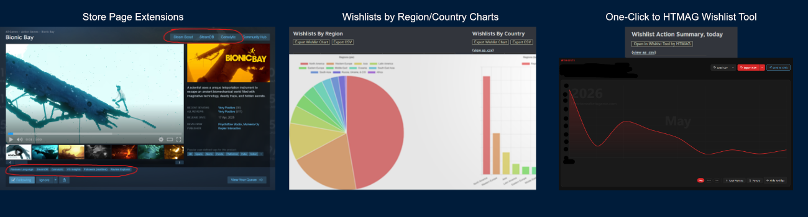
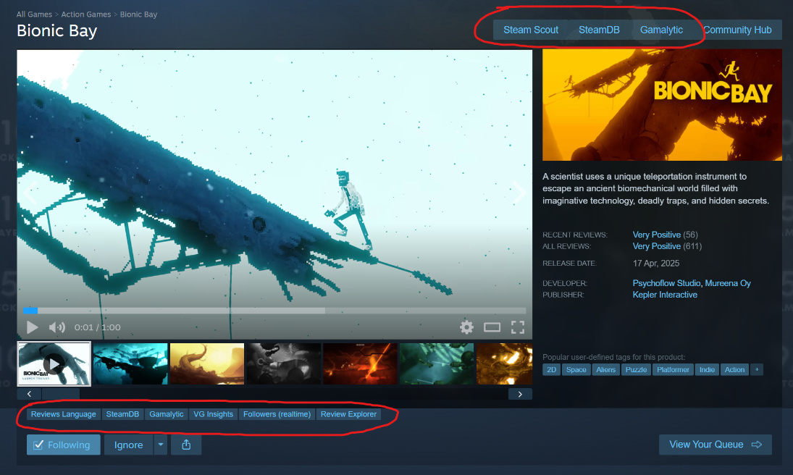
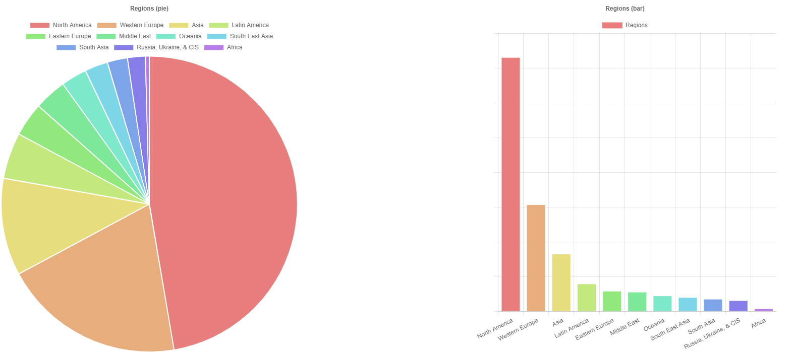
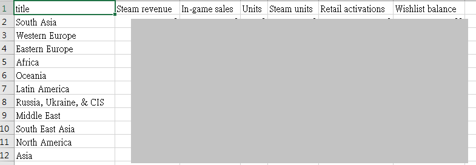
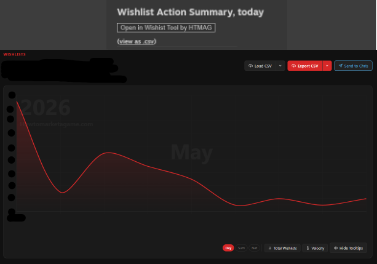

# Steam Marketing Tool

Steam Marketing Tool is a Chrome Extension for analyzing marketing data on Steam and Steamworks.
- [Steam Marketing Tool](#steam-marketing-tool)
- [Features](#features)
  - [Extend Store Page for better navigation](#extend-store-page-for-better-navigation)
    - [Customization](#customization)
  - [Export Regional Wishlists on Steamworks](#export-regional-wishlists-on-steamworks)
    - [Export Wishlist Chart](#export-wishlist-chart)
    - [Export CSV](#export-csv)
  - [Open Steam Wishlist History in External Tool by HTMAG](#open-steam-wishlist-history-in-external-tool-by-htmag)
- [Getting Started](#getting-started)
  - [Install Chrome Extension](#install-chrome-extension)
- [Chart Tool (for regional wishlists)](#chart-tool-for-regional-wishlists)
    - [GET Params](#get-params)

# Features
## Extend Store Page for better navigation
Matching URL: `*://store.steampowered.com/app/*`

e.g. https://store.steampowered.com/app/1928690/Bionic_Bay/

* [SteamDB](https://steamdb.info/)
* [Steam Scout](https://www.togeproductions.com/SteamScout/steamAPI.php) - To break down Steam reviews by languages.
* [Gamalytic](https://gamalytic.com/)
* [VG Insights](https://vginsights.com/)
* Real-time followers - https://steamcommunity.com/search/groups/
* ~~[SteamData.Ninja](https://www.steamdata.ninja/)~~ (dead)
* Review Explorer - https://project.joshhills.dev/steam-review-explorer
* Micro Trailer - To watch the micro trailer of the game, which is automatically generated by Steam and will be used on the hover tool in the future: https://store.steampowered.com/labs/microtrailers
> It is compatible with [AugmentedSteam](https://github.com/IsThereAnyDeal/AugmentedSteam) which is a more powerful extension:)

### Customization
Don't like the default buttons? Feel free to add/remove any links on your own:/

> If you know of other powerful websites for Steam marketing/analysis, please share them to [**Issues**](https://github.com/qwe321qwe321qwe321/SteamMT/issues). I'd appreciate it.

https://user-images.githubusercontent.com/23000374/229375397-bc41ce0c-5b95-49ec-b25a-3dd60f2ef9b4.mp4

## Export Regional Wishlists on Steamworks
Matching URL: `*://partner.steampowered.com/app/wishlist/*`

Steamworks has moved regional wishlist data into the app wishlist report page. SteamMT now also adds `Export Wishlist Chart` and `Export CSV` buttons to:
* `Wishlists By Region`
* `Wishlists By Country`

On the app wishlist page, these exports use whatever date range is currently shown on the page. They do not force `all history`.

### Export Wishlist Chart
Passing data to [Chart Tool](#chart-tool-for-regional-wishlists) to show the regional wishlist charts.

### Export CSV
Export and download a CSV file.

## Open Steam Wishlist History in External Tool by HTMAG
Matching URL: `*://partner.steampowered.com/app/wishlist/*`

SteamMT adds an `Open in Wishlist Tool` button next to the `Wishlist Action Summary` CSV link on the wishlist report page.

To learn more about this tool, watch the [video](https://www.youtube.com/watch?v=GJvARUZqzDs).

Clicking that button will:
* jump to `View most recent > all history` automatically when needed
* download the per-game `Wishlist Action Summary, all history` CSV from Steamworks
* open `https://howtomarketagame.com/wishlists/` in a new tab
* auto-import the CSV into the chart tool

Notes:
* This works by using the extension as a bridge. The external website does not expose a public import API.
* SteamMT validates that the downloaded CSV contains the expected header: `DateLocal,Game,Adds,Deletes,PurchasesAndActivations,Gifts`
* If Steamworks gives you the wrong CSV file, SteamMT will stop instead of importing a studio-wide summary by mistake.

# Getting Started
## Install Chrome Extension
As the extension hasn't been added to the Chrome Store yet, you can only install it manually. Here are the steps to follow:
* Clone this repository or download the ZIP file and unzip it.
* Go to `chrome://extensions/`.
* Turn on `developer mode`.
* Click on the **Load unpacked** button and select the `chrome-extension` folder from where you downloaded/cloned.

Video: https://www.youtube.com/watch?v=JD7eneh7zZM

# Chart Tool (for regional wishlists)
https://qwe321qwe321qwe321.github.io/SteamMT/chart/

The input data is passed through GET parameters, and this page doesn't store any private information. You can share the link to show anyone the statistics, even though it'd be terribly LOOOOOOOOOOOOOOONG:O

### GET Params
| Param | Type | Description |
| --- | --- | --- |
| data | Base64 Encode object { title: <_String_>, xValues: [...<_String_>], yValues: [...<_Number_>] } | The input data for charts. |
| topN | Number (> 0) | Only display top N results. |

